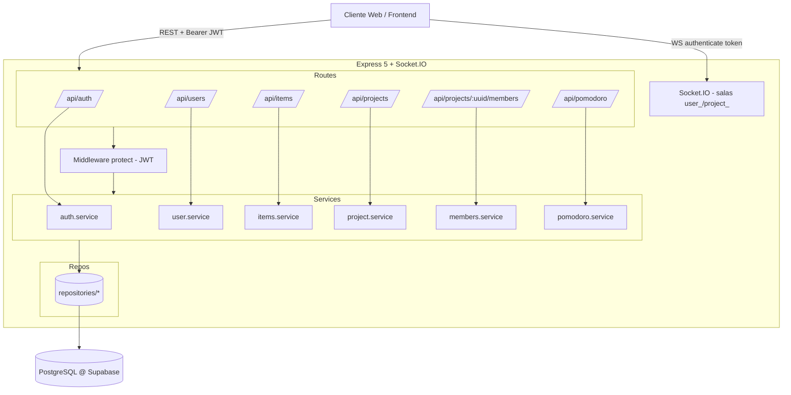
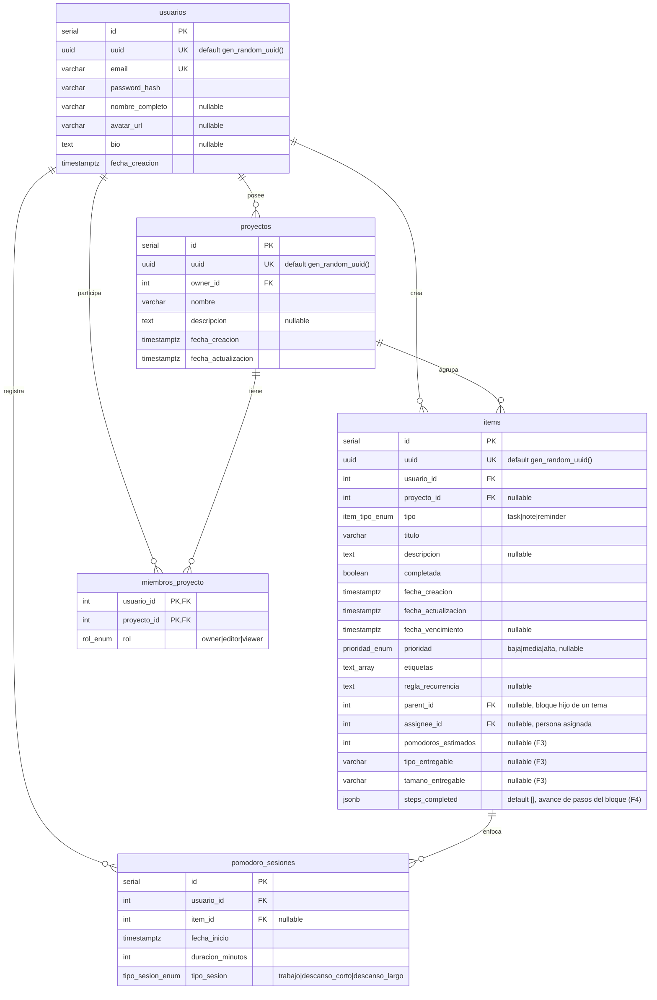

# Software Design Document (SDD) — backend-ToDo

> Documento de diseño de software para la API de gestión de tareas, proyectos
> colaborativos y sesiones Pomodoro. Base de datos PostgreSQL alojada en Supabase.
>
> Última actualización: 2026-06-07

---

## 1. Resumen

`backend-ToDo` es una API REST + tiempo real (WebSockets) construida con
**Express 5**, **Socket.IO** y **PostgreSQL** (`pg`). Permite a los usuarios
gestionar *items* (tareas, notas, recordatorios), organizarlos en *proyectos*
colaborativos con roles, e iniciar sesiones de *Pomodoro*.

| Aspecto | Tecnología |
|---|---|
| Lenguaje | TypeScript 5.9 (ESM vía `ts-node-dev`) |
| Framework HTTP | Express 5 |
| Tiempo real | Socket.IO 4 |
| Base de datos | PostgreSQL (Supabase), driver `pg` con `Pool` |
| Autenticación | JWT (`jsonwebtoken`) + hashing `bcryptjs` |
| Validación | `express-validator` |
| Gestor de paquetes | pnpm 10 |

---

## 2. Objetivos y alcance

- **En alcance:** CRUD de items, gestión de perfil de usuario, autenticación,
  proyectos colaborativos con roles (owner/editor/viewer), invitación de
  miembros por email, registro de sesiones Pomodoro, notificaciones en tiempo
  real por sala (usuario y proyecto).
- **Fuera de alcance (hoy):** suscripciones/pagos, recordatorios programados
  (el controlador `reminder.controller.ts` está vacío), recuperación de
  contraseña, refresh tokens.

---

## 3. Arquitectura

El proyecto sigue una **arquitectura en capas** clásica:

```
HTTP / WebSocket
      │
      ▼
┌─────────────┐   Express Router + middleware (protect JWT, express-validator)
│   Routes    │
└─────┬───────┘
      ▼
┌─────────────┐   Traducen req/res ↔ casos de uso. Manejo de códigos HTTP.
│ Controllers │
└─────┬───────┘
      ▼
┌─────────────┐   Reglas de negocio, permisos por rol, transacciones lógicas.
│  Services   │
└─────┬───────┘
      ▼
┌─────────────┐   SQL parametrizado contra el Pool de `pg`.
│Repositories │
└─────┬───────┘
      ▼
┌─────────────┐
│ PostgreSQL  │  (Supabase)
└─────────────┘
```

### 3.1 Diagrama de componentes (Mermaid)



---

## 4. Endpoints

Todas las rutas excepto `/api/auth/*` requieren cabecera
`Authorization: Bearer <token>`.

| Método | Ruta | Descripción |
|---|---|---|
| POST | `/api/auth/register` | Registrar usuario |
| POST | `/api/auth/login` | Login → devuelve JWT (exp. 1h) |
| GET | `/api/users/me` | Perfil del usuario autenticado |
| PUT | `/api/users/me` | Actualizar `nombre_completo`, `bio` |
| GET | `/api/items` | Listar items (filtros `tipo`, `proyectoId`); incluye padres y bloques |
| GET | `/api/items/focus` | Tareas pendientes para el Pomodoro (personales + asignadas al usuario) |
| POST | `/api/items` | Crear item |
| POST | `/api/items/:uuid/subtasks` | Crear bloques (sub-tareas) en lote bajo un tema (owner/editor) |
| PUT | `/api/items/:uuid` | Actualizar item. Campos: `titulo`, `descripcion`, `completada`, `fecha_vencimiento`, `prioridad`, `etiquetas`, `assignee_id` (reparto por persona; en la UI se asigna **por bloque/sub-tarea**), `pomodoros_estimados`, `tipo_entregable`, `tamano_entregable`, **`steps_completed`** (array de booleans, JSONB) |
| DELETE | `/api/items/:uuid` | Eliminar item |
| GET | `/api/reminders/upcoming` | Recordatorios con vencimiento futuro |
| GET | `/api/reminders/due` | Recordatorios vencidos sin completar |
| POST | `/api/projects` | Crear proyecto (crea membresía `owner`) |
| GET | `/api/projects` | Proyectos del usuario |
| GET | `/api/projects/:uuid` | Detalle de proyecto |
| PUT | `/api/projects/:uuid` | Actualizar proyecto (solo owner) |
| DELETE | `/api/projects/:uuid` | Eliminar proyecto (solo owner) |
| GET | `/api/projects/:uuid/my-role` | Rol del usuario en el proyecto |
| POST | `/api/projects/:projectUuid/members` | Invitar miembro por email |
| GET | `/api/projects/:projectUuid/members` | Listar miembros |
| PUT | `/api/projects/:projectUuid/members/:userUuid` | Cambiar rol (solo owner) |
| DELETE | `/api/projects/:projectUuid/members/:userUuid` | Quitar miembro (solo owner) |
| POST | `/api/pomodoro/log` | Registrar sesión Pomodoro |

### 4.1 Eventos Socket.IO

| Evento | Dirección | Descripción |
|---|---|---|
| `authenticate` | cliente→servidor | Envía JWT; une al socket a la sala `user_<id>` |
| `join_project` | cliente→servidor | Une el socket a `project_<id>` |
| `leave_project` | cliente→servidor | Saca el socket de `project_<id>` |
| `joined_message` / `user_joined` | servidor→cliente | Confirmaciones de sala |

---

## 5. Modelo de datos (según el código real)

> ⚠️ Este es el modelo que las **consultas SQL del código esperan**, derivado de
> los repositorios. **No coincide con `src/config/tablesPg.txt`** (ver §6).

### 5.1 Diagrama Entidad-Relación (Mermaid)



### 5.2 Tipos ENUM requeridos

| ENUM | Valores | Usado en |
|---|---|---|
| `prioridad_enum` | `baja`, `media`, `alta` | `items.prioridad` |
| `item_tipo_enum` | `task`, `note`, `reminder` | `items.tipo` |
| `rol_proyecto_enum` | `owner`, `editor`, `viewer` | `miembros_proyecto.rol` |
| `tipo_sesion_pomodoro_enum` | `trabajo`, `descanso_corto`, `descanso_largo` | `pomodoro_sesiones.tipo_sesion` |

---

## 6. Análisis: ¿`tablesPg.txt` se alinea con el proyecto?

**Veredicto: NO. El archivo `src/config/tablesPg.txt` está muy desactualizado**
y solo cubre ~30% del esquema que el código realmente consulta. Si ejecutas ese
script tal cual, la aplicación fallará en casi todos los endpoints salvo
register/login básico.

### 6.1 Discrepancias concretas

| # | `tablesPg.txt` dice | El código espera | Impacto |
|---|---|---|---|
| 1 | Tabla `tareas` | Tabla `items` | 🔴 `findByUserId`, `create`, etc. fallan (`relation "items" does not exist`) |
| 2 | `tareas.fecha_modificacion` | `items.fecha_actualizacion` | 🔴 `ORDER BY fecha_actualizacion` y `SET fecha_actualizacion = NOW()` fallan |
| 3 | `tareas` no tiene `tipo`, `titulo`, `proyecto_id`, `fecha_vencimiento`, `regla_recurrencia` | `items` los inserta/lee | 🔴 INSERT de 10 columnas falla |
| 4 | No existe `proyectos` (con `uuid`, `owner_id`, `fecha_actualizacion`) | Requerida | 🔴 Todo `/api/projects` falla |
| 5 | No existe `miembros_proyecto` | Requerida (con constraint único) | 🔴 Colaboración y permisos fallan |
| 6 | No existe `pomodoro_sesiones` | Requerida | 🔴 `/api/pomodoro/log` falla |
| 7 | `usuarios` sin `nombre_completo`, `avatar_url`, `bio` | `findById`/`update` los leen | 🔴 `GET/PUT /users/me` fallan |
| 8 | Faltan ENUMs `item_tipo`, `rol`, `tipo_sesion` | Requeridos | 🔴 |
| 9 | `CREATE DATABASE tododb;` | — | 🟠 En Supabase **no** puedes crear bases de datos; ya usas la BD `postgres` provista |

### 6.2 Lo único correcto

- `prioridad_enum AS ENUM ('baja','media','alta')` ✅ (coincide con `ItemPriority`)
- `usuarios.id SERIAL PRIMARY KEY`, `email UNIQUE`, `password_hash`,
  `fecha_creacion TIMESTAMPTZ DEFAULT NOW()` ✅
- Patrón `FOREIGN KEY ... ON DELETE CASCADE` e índice por `usuario_id` ✅ (buena idea, extender a las demás tablas)

---

## 7. Recomendaciones para la BD en Supabase

### 7.1 Esquema y migraciones

1. **Elimina `CREATE DATABASE`.** En Supabase trabajas dentro de la BD
   `postgres` y el esquema `public`. Crea ahí tus tablas.
2. **Sustituye `tablesPg.txt` por migraciones versionadas.** Usa el
   **Supabase CLI** (`supabase migration new <nombre>`) o numera los archivos
   (`001_init.sql`, `002_...`). Así el esquema es reproducible y revisable en
   git. Ver `docs/schema.sql` como punto de partida.
3. **`updated_at` por trigger, no por la app.** Hoy dependes de
   `SET fecha_actualizacion = NOW()` en cada UPDATE. Un trigger garantiza la
   consistencia aunque alguien escriba por el SQL Editor de Supabase
   (incluido en `schema.sql`).
4. **Índices.** Añade índices a las FKs y a los filtros frecuentes:
   `items(usuario_id)`, `items(proyecto_id)`, `miembros_proyecto(proyecto_id)`,
   `proyectos(owner_id)`, y `UNIQUE(proyecto_id, usuario_id)` en miembros
   (el código ya maneja el error `23505`, así que la constraint debe existir).
5. **`items.steps_completed` (migración `009_steps_completed.sql`, aplicada el
   2026-06-15).** Columna `JSONB NOT NULL DEFAULT '[]'` con el estado de los
   checkboxes de pasos de un bloque (array de booleans alineado por índice con
   los pasos extraídos de la descripción). Al ser JSONB, el controller la
   serializa con `JSON.stringify` antes del `UPDATE` (el repositorio es genérico
   y de lo contrario `pg` la enviaría como array de Postgres). Los grants son a
   nivel de tabla (006/007), así que `btaskora_app` la cubre sin cambios extra.

### 7.2 Conexión (`src/config/database.ts`)

5. **Habilita SSL.** Supabase exige TLS. Añade al `Pool`:
   ```ts
   ssl: { rejectUnauthorized: false } // o configura el CA de Supabase
   ```
   o usa `DATABASE_URL` con `?sslmode=require`.
6. **Usa el connection pooler de Supabase.** Para conexiones desde un backend
   con `pg.Pool`, conéctate al **Session Pooler / Transaction Pooler**
   (Supavisor) en lugar del puerto directo 5432, especialmente si despliegas en
   un entorno con escalado horizontal. Recomendado: usar la cadena
   `DATABASE_URL` que da el panel de Supabase ("Connect" → ORMs/Node).
7. **Limita el pool.** Define `max` (p. ej. 10) acorde al plan de Supabase para
   no agotar conexiones.

### 7.3 Estrategia de identificadores (UUID vs SERIAL)

8. Hoy `proyectos` usa **doble identificador** (`id SERIAL` interno +
   `uuid` público). Es válido, pero decide una estrategia coherente:
   - **Opción A (mínimo cambio):** mantén `id SERIAL` PK y añade
     `uuid UUID UNIQUE NOT NULL DEFAULT gen_random_uuid()` (lo que el código ya
     asume). Aplícalo también a `items` si vas a exponer IDs de items al
     frontend, para no filtrar IDs secuenciales.
   - **Opción B (más limpio):** usa `uuid` como PK en todas las tablas con
     `gen_random_uuid()`. Implica refactor de los repositorios (hoy usan
     `:id` numérico en items/members). Más trabajo, pero IDs no enumerables.

   Nota de inconsistencia actual: proyectos se direccionan por `uuid` en las
   rutas, pero items y miembros (`:userId`) siguen usando IDs numéricos.

### 7.4 Seguridad / Row Level Security (RLS)

9. **Entiende cómo te afecta RLS.** Te conectas con `pg` directo usando un
   usuario de base de datos (no `supabase-js`/PostREST ni Supabase Auth). Si
   ese usuario es el `postgres`/`service_role`, **RLS se omite** y la seguridad
   recae 100% en tu middleware `protect` + chequeos de rol en los servicios.
   Eso es aceptable, pero:
   - Mantén **RLS activado** en todas las tablas (Supabase lo recomienda) para
     que la API auto-generada de Supabase no quede abierta por accidente.
   - No expongas la `anon key` ni el endpoint PostgREST si no los usas.
   - Considera un **usuario de BD dedicado y con permisos mínimos** para la app
     en vez de `postgres`.
10. **Gestión de secretos.** El archivo `.env` está abierto en tu editor;
    confirma que está en `.gitignore` (no aparece en `git ls-files`, bien) y
    rota `JWT_SECRET` y credenciales de BD si alguna vez se subieron.

### 7.5 Consistencia de datos

11. **`NOT NULL` y `DEFAULT` explícitos** en columnas que el código nunca envía
    (p. ej. `pomodoro_sesiones.fecha_inicio` se omite en el INSERT → necesita
    `DEFAULT NOW()`).
12. **`ON DELETE CASCADE`** en `items.proyecto_id`, `miembros_proyecto.*`,
    `pomodoro_sesiones.*` para que borrar un proyecto/usuario limpie lo
    dependiente (el comentario en `project.repository.remove` ya lo asume).
13. **Restringe `etiquetas`** a `TEXT[] NOT NULL DEFAULT '{}'` (el código manda
    `[]` por defecto).

---

## 8. Estrategia de identificadores (implementada)

Se adoptó la **opción híbrida**: `id SERIAL` como PK interna (FKs y joins en
enteros) + columna pública `uuid UUID UNIQUE DEFAULT gen_random_uuid()` en las
tablas expuestas en URLs (`usuarios`, `proyectos`, `items`). Las rutas quedan
homogéneas y por UUID:

- `/api/items/:uuid` (antes `:id` numérico)
- `/api/projects/:uuid`
- `/api/projects/:projectUuid/members/:userUuid` (antes `:userId` numérico)

El service resuelve el `uuid` → registro (y su `id` interno) en el punto de
entrada (`findByUuidInternal`, `findIdByUuid`), manteniendo intacta la lógica de
negocio basada en ids numéricos.

> Nota: el `proyecto_id` que se envía en el *body* al crear items sigue siendo
> numérico. El frontend lo obtiene del listado de proyectos (que incluye `id`).
> Migrarlo a `proyecto_uuid` es una mejora opcional futura.

## 9. Deuda técnica observada (no bloqueante)

- `auth.middleware.protect` no hace `return` tras enviar el 401; revisar para
  evitar posibles "headers already sent" en casos límite.
- `members.service.addMember` quedó sin uso (el flujo activo es
  `addMemberByEmail` vía el controlador `inviteMember`). Se puede eliminar.

> ✅ Corregido en esta iteración: las rutas de miembros usaban
> `parseInt(req.params.projectId)` pero el parámetro real es `projectUuid`, lo
> que producía `NaN` y rompía GET/PUT/DELETE de miembros. Ahora resuelven el
> `projectUuid` a id numérico.

---

## 10. Módulo de recordatorios (REST)

Implementado como endpoints de **solo lectura**; el vencimiento y las
notificaciones los maneja el frontend (no hay scheduler en el servidor):

- `GET /api/reminders/upcoming` — items `tipo='reminder'`, sin completar, con
  `fecha_vencimiento >= NOW()`, ordenados por la más próxima.
- `GET /api/reminders/due` — ídem pero `fecha_vencimiento <= NOW()`.

Filtran por `usuario_id` (recordatorios personales del usuario autenticado).
Capas: `reminder.routes → reminder.controller → reminder.service →
reminder.repository`.

---

## 11. Próximos pasos sugeridos

1. Aplicar `docs/schema.sql` en Supabase (SQL Editor o migración CLI).
2. ~~Añadir SSL + `DATABASE_URL` en `database.ts`.~~ ✅ hecho
3. ~~Borrar `src/config/tablesPg.txt`.~~ ✅ hecho
4. ~~Decidir estrategia de UUID y homogeneizar rutas.~~ ✅ hecho (híbrida)
5. ~~Implementar o retirar el módulo de recordatorios.~~ ✅ implementado (REST)
6. (Opcional) Migrar `proyecto_id` del body de items a `proyecto_uuid`.
7. (Opcional) Eliminar `members.service.addMember` sin uso.
```

